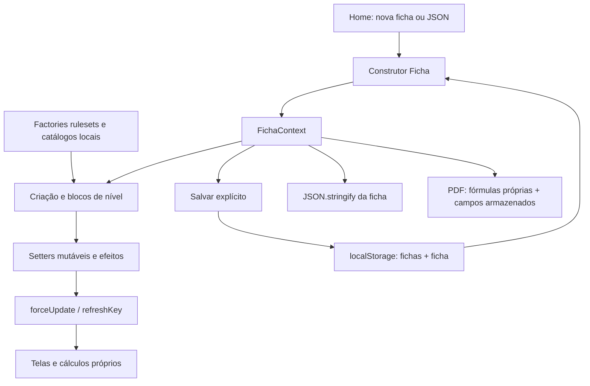

# Auditoria técnica e de regras — Minha Ficha D&D

Data da análise e das consultas: **06/10/2026**, America/Sao_Paulo. Base Git: `89642a44a1a6f9c6d4317ab7fb1af7e77b885e78`, **incluindo alterações locais e arquivos não rastreados existentes**, especialmente a implementação de 2024. As linhas abaixo pertencem a esse estado, não apenas ao commit. Não houve correção de código, atualização de dependências ou commit.

## 1. Estado real do projeto

O projeto é uma aplicação React executada no navegador, com criação e edição de fichas, catálogos locais, inventário, seleção de magias, salvamento explícito em `localStorage`, importação/exportação JSON e geração de PDF. A estrutura de 2024 existe: escolha inicial da edição, 12 classes, espécies, antecedentes e subclasses próprios. **Isso ainda não constitui suporte funcional completo a 2024**, e os fluxos de 2014 também têm erros centrais.

A prioridade é preservar dados: a recuperação de armazenamento inválido sobrescreve o conteúdo com `[]` (A01, reproduzido). Em seguida vêm reabertura/edição, progressão e cálculos. Não é necessário trocar React, adicionar servidor ou reescrever o projeto para resolver esses problemas.

| Estado | Funcionalidades observadas |
|---|---|
| Implementadas, com verificações delimitadas | Escolha e serialização de edição; modificador de atributo e bônus de proficiência; salvamento explícito; listas de equipamentos; montagem do aplicativo e build de produção. |
| Parciais ou incorretas | Autosave anunciado; restauração de escolhas; hidratação das entidades; multiclasses; aumentos de atributos; talentos; magias; cálculos derivados; PDF; características mecânicas de espécies/classes. |
| Descritivas, sem automação completa | Muitas características de classes/subclasses, sentidos, resistências, recursos limitados, talentos de origem e maestrias. A presença do texto não foi contabilizada como automação. |
| Simulada | “Exportar XML” apenas escreve no console. |
| Ausentes no código examinado | Backend, login, sincronização entre dispositivos, schema/migrações explícitos, histórico de recuperação, conversão de edição pela UI, gestão geral de descansos/condições/PV temporários/dados de vida gastos. São lacunas de escopo, não exigências automáticas de implementação. |

O build seguro compilou. O teste existente falhou. O lint terminou com zero erros e um aviso, mas não valida regras. Não existe `tsconfig.json` na raiz; uma checagem exploratória separada produziu 625 diagnósticos, majoritariamente incompatibilidade de imports com TS 4.9. Não se deve interpretar build ou lint aprovado como aprovação de tipagem ou das regras.

## 2. Arquitetura e caminho dos dados

Não foi encontrado `AGENTS.md` na árvore do projeto nem nos diretórios ancestrais consultados. Foram lidos `README.md`, `my-app/README.md`, `package.json`, configuração de lint e workflow. O segundo README é um molde de Next.js, mas a aplicação efetiva é Create React App.

| Módulo | Responsabilidade real e acoplamentos |
|---|---|
| `src/App.js:1–25`, `src/pages/home.jsx:18–69` | Provider global, rotas `/` e `/criar-ficha`, criação, importação e seleção. Não há autenticação. |
| `src/pages/criarFicha.js:14–161` | Composição desktop/mobile; menu de salvar/JSON/PDF/XML. Mobile desmonta componentes ao mudar de aba. |
| `src/api/fichaPersonagem/FichaContext.tsx:1–125` | Coleção de fichas, seleção atual, leitura/gravação de `localStorage`, `refreshKey`. Não é um repositório transacional nem um autosave de cada mutação. |
| `src/api/fichaPersonagem/FichaPersonagem.ts:15–500` | Entidade mutável, dados do usuário, cópias de conteúdo, derivados e setters. Construtor restaura somente a instância externa. |
| `src/api/rulesets/` | Seleção de catálogos 2014/2024; flags de regras e nomes de UI. As factories recriam entidades a cada chamada. Armas, armaduras, itens e magias retornam arrays vazios, enquanto as telas usam bibliotecas globais. |
| `src/api/classesPrincipais`, `classesClassesFilhos`, `classesClassesNetos`, `classesFilhos`, `classesNetos`, `backGroundsFilhos` | Modelos base, classes/subclasses e raças/sub-raças/antecedentes. Conteúdo e comportamento estão misturados; nomes e IDs gerados são usados como identidade. |
| `src/pages/components/CriacaoFicha.tsx`, `src/leveis/LevelUm.tsx`, `src/leveis/NivelBlock.tsx` | Regras de elegibilidade, distribuição de atributos, escolhas, níveis e mutações. Grande parte do motor vive dentro da UI. |
| `src/bibliotecas/` | Dados manuais de magias, itens, talentos e características. Não foi localizado consumo de API remota para esses catálogos. |
| `src/api/fichaPersonagem/fichaEfeitosUtils.ts` | Normalização, soma de efeitos e inferência de mecânicas a partir de prosa de itens com regex. Usado por algumas telas, mas não uniformemente. |
| `InformacoesPersonagem`, `PericiasEOutros`, `ModalVida`, `AbaMagias`, `AbaArmas`, `AbaArmaduras`, `AbaItens` | Exibição e cálculos parcialmente independentes; diversos estados temporários ficam fora de `Ficha`. |
| `src/utils/exportarFichaPdf.ts` | Busca o template estático em `public/`, desenha dados em três páginas e dispara download. Reimplementa cálculos e usa campos derivados que a UI não atualiza. |

**Criar:** Home instancia `Ficha({versaoRegras})`, define nível 1 e salva imediatamente uma ficha ainda incompleta. Os modais selecionam instâncias dos catálogos. `LevelUm` cria atributos; bônus alteram a instância depois de calcular iniciativa. Origem/perícias/efeitos são combinados por handlers.

**Evoluir:** há 20 blocos de planejamento. `multiclasses[].nivelEscolhido` registra os níveis do personagem atribuídos à classe; `nivelClasse` mantém outro contador; o nível ativo é escolhido separadamente em `InformacoesPersonagem.tsx:322`. Alguns cálculos filtram o planejamento por nível ativo, outros consultam arrays completos. Alterar uma escolha tenta apagar/reindexar dependências na UI.

**Editar e salvar:** setters mudam o objeto atual; `forceUpdate` altera apenas um contador. O efeito de gravação depende de `fichas`, não de cada campo. “Salvar Ficha” cria nova referência da lista e grava. O JSON exporta o objeto em memória, que pode ser mais recente do que a cópia no armazenamento.

**Reabrir/importar:** `JSON.parse` → `new Ficha` → referências aninhadas continuam objetos comuns. Idiomas, escolhas de perícias e métodos de distribuição também possuem estado React separado, não reidratado. Isso explica diferenças entre uma ficha recém-criada e reaberta.

**Edição:** `versaoRegras` é gravada e exportada. Ausência assume 2014; valor desconhecido não é rejeitado, e o dispatcher cai no catálogo 2014. Não há seletor de conversão de ficha existente na UI. Não foi presumida necessidade de conversão automática.

## 3. Fontes pesquisadas, versões e limites

Todas as fontes normativas utilizadas abaixo são oficiais. Resultados de fóruns apareceram nas buscas, mas **não foram utilizados como autoridade de regra**, mesmo quando hospedados no domínio D&D Beyond. Consulta em 06/10/2026; o nome comercial “5.5e” encontrado nas fontes é tratado aqui como a revisão de 2024.

| ID | Fonte e abrangência |
|---|---|
| S01 | [Portal oficial dos SRDs](https://www.dndbeyond.com/srd). Identifica 5.1 e 5.2.1, licenças, escopo e histórico. A página informa atualização em 02/03/2026. |
| S02 | [SRD 5.1, CC BY 4.0](https://www.dndbeyond.com/attachments/39j2li89/SRD5.1-CCBY4.0License.pdf). Base aberta da edição 2014; não representa todo PHB ou suplementos. |
| S03 | [SRD 5.2.1, CC BY 4.0](https://media.dndbeyond.com/compendium-images/srd/5.2/SRD_CC_v5.2.1.pdf). Base aberta revisada; inclui correções posteriores ao lançamento de 2024. PDF de 364 páginas, consulta textual. |
| S04 | [Criação 2014](https://www.dndbeyond.com/sources/dnd/basic-rules-2014/step-by-step-characters). Atributos, criação e avanço. |
| S05 | [Personalização 2014](https://www.dndbeyond.com/sources/dnd/basic-rules-2014/customization-options). Multiclasse e talentos como regras opcionais; pré-requisitos e progressão combinada. |
| S06 | [Classes 2014](https://www.dndbeyond.com/sources/dnd/basic-rules-2014/classes). Progressões e conjuração disponíveis nesse compêndio gratuito. |
| S07 | [Criação revisada](https://www.dndbeyond.com/sources/dnd/br-2024/creating-a-character). Origem, idiomas, atributos, avanço e multiclasse. |
| S08 | [Classes revisadas](https://www.dndbeyond.com/sources/dnd/br-2024/character-classes). Tabelas das 12 classes e subconjunto gratuito de subclasses. |
| S09 | [Origens revisadas](https://www.dndbeyond.com/sources/dnd/br-2024/character-origins). Espécies e antecedentes disponíveis gratuitamente. |
| S10 | [Talentos revisados](https://www.dndbeyond.com/sources/dnd/br-2024/feats). Categorias, pré-requisitos, ASI e subconjunto de talentos. |
| S11 | [Equipamento 2014](https://www.dndbeyond.com/sources/dnd/basic-rules-2014/equipment). Armas, armaduras, escudos e proficiência. |
| S12 | [Equipamento revisado](https://www.dndbeyond.com/sources/dnd/br-2024/equipment). Treinamento, escudos, armas e maestrias. |
| S13 | [Magias revisadas](https://www.dndbeyond.com/sources/dnd/br-2024/spell-descriptions). Magias gratuitas; consulta confrontada com errata quando necessário. |
| S14 | [Glossário revisado](https://www.dndbeyond.com/sources/dnd/br-2024/rules-glossary). Condições, PV, dados de vida, descansos e demais termos. |
| S15 | [Errata PHB 2024 v1.0, ©2025](https://media.dndbeyond.com/compendium-images/errata/PHB-24/PHB-2024_v1.pdf). Correções de espécies, talentos, equipamentos, magias e glossário. Não equivale a acesso ao livro completo. |
| S16 | [Aventuras/descansos 2014](https://www.dndbeyond.com/sources/dnd/basic-rules-2014/adventuring). Recuperação e atividades. |
| S17 | [Uso de atributos 2014](https://www.dndbeyond.com/sources/dnd/basic-rules-2014/using-ability-scores). Perícias, bônus, modificadores e testes passivos. |

**Compatibilidade verificada:** em ficha revisada, espécie antiga não fornece seu antigo aumento de atributos; antecedente antigo recebe os ajustes apropriados e, se não conceder talento, permite talento de origem. Isso não torna toda opção antiga incompatível, nem autoriza reutilizar qualquer entidade sem adaptação. Para subclasses de suplementos não disponíveis nessas fontes, a compatibilidade individual permanece não verificada. [S07](https://www.dndbeyond.com/sources/dnd/br-2024/creating-a-character#AdjustAbilityScores)

**Erratas versus página online:** na resposta consultada de S13, `Conjure Minor Elementals` ainda apresentava incremento de 2d8 por espaço acima do 4º; S15 corrige esse incremento para 1d8, e S03, p. 118, contém 1d8. Não adotar a página gratuita isoladamente como prova de atualização. O texto de Porte Poderoso do Golias em dnd2024/index.ts:140 já usa teste de atributo, alinhado à correção de S15; isso não certifica os demais traços. [Magias](https://www.dndbeyond.com/sources/dnd/br-2024/spell-descriptions#ConjureMinorElementals), [errata](https://media.dndbeyond.com/compendium-images/errata/PHB-24/PHB-2024_v1.pdf), [SRD 5.2.1](https://media.dndbeyond.com/compendium-images/srd/5.2/SRD_CC_v5.2.1.pdf)

Não foi certificado cada parágrafo dos catálogos nem todas as subclasses de livros pagos. A auditoria cobre arquitetura, fluxos e famílias de regra solicitadas, com amostras executadas e revisão dirigida do restante. Ausência de conteúdo fora do SRD não é, por si só, bug. A disponibilidade pública de uma página também não demonstra licença para redistribuir sua tradução, imagens ou PDF.

## 4. Matriz de conformidade 2014 × 2024

Os locais são relativos à raiz. “Correto” é limitado à unidade indicada; não certifica a ficha inteira. Referências Sxx remetem aos links da seção 3.

| Área/regra | Esperado 2014 | Esperado 2024 | Implementação/localização | Status | Impacto |
|---|---|---|---|---|---|
| Edição e documento | Preservar edição/conteúdo | Idem, sem conversão implícita | `FichaPersonagem.ts:64–116`; dispatcher `getRulesetData.ts:5–14` | Parcial | Edição válida persiste; desconhecida é aceita. A05. |
| Modificadores | Piso de `(valor−10)/2` [S04] | Mesma fórmula [S07] | `FichaPersonagem.ts:119–120`; V01 | Correto na função | Base aritmética correta. |
| Distribuição | Array, 4d6 descartando menor, point buy opcional [S04] | Métodos equivalentes [S07] | `LevelUm.tsx:124–204,393–407` | Parcial | Geradores/custos coerentes; conclusão aceita zeros. A07. |
| Origem dos aumentos | Raça/sub-raça [S04] | Antecedente, +2/+1 ou +1/+1/+1 nos três atributos [S07] | `LevelUm.tsx:214–239`; rulesets | Parcial | Seleção funciona em parte, sem histórico de escolhas. A04/A07. |
| Espécies, traços, sentidos | Traços da raça/sub-raça [S02] | Traços revisados/linhagens [S09] | `CriacaoFicha.tsx:212–277`; `dnd2024/index.ts:60–183` | Parcial | Descrição não garante velocidade, sentidos ou perícias efetivos. A18. |
| Idiomas | Raça e antecedentes [S02] | Comum e duas escolhas padrão, mais características [S07] | `CriacaoFicha.tsx:29–40,389–415` | Parcial | Reabertura perde seleção local. A04. |
| Classes/subclasses | Nível de entrada varia; patrono e pacto têm funções distintas [S06] | Subclasses no nível 3 [S08] | `LevelUm.tsx:296–308`; `NivelBlock.tsx:221–234,609–640` | Parcial | Gates principais existem; patrono legado vaza e edição perde subclassificação. A09/A16. |
| Multiclasse | Validar classe de origem e destino [S05] | Validar habilidades primárias pertinentes [S07] | `NivelBlock.tsx:133–147` | Incorreto | Nomes não coincidem; origem não validada. A08. |
| Aumentos por avanço | ASI/talento opcional em níveis da classe [S06] | ASI/talentos e dádiva épica previstos pela progressão [S08/S10] | `NivelBlock.tsx:252–261`; classes 2024 | Incorreto | Nenhuma das 12 classes 2024 reconhece ASI no nível 4. A06. |
| Talentos/pré-requisitos | Restrições e benefícios da opção [S02/S05] | Categoria, nível, repetibilidade e benefícios [S10] | `ModalSelecaoTalento.tsx:3–55`; `TalendoDescricao.tsx:19–21` | Incorreto/parcial | Não valida requisitos; texto pode vir de 2014. A15. |
| Bônus de proficiência | +2 a +6 pelo nível total [S04] | Mesma progressão [S07] | `FichaPersonagem.ts:184–218,248–251`; V01 | Correto para 1–20 | Não valida nível externo. |
| Perícias/especialização | Aplicar atributo final, proficiência e especialização [S17] | Idem, observando características revisadas [S08] | `PericiasEOutros.tsx:16–148,168–189` | Parcial | Ignora efeitos de atributo e especialização. A12. |
| Salvaguardas | Proficiências iniciais e benefícios posteriores [S06] | Idem conforme classe [S08] | `InformacoesPersonagem.tsx:51–57` | Parcial | Classe principal consultada; benefícios posteriores não derivados. A12. |
| PV máximos | Dado máximo no primeiro nível; ganho posterior e CON [S04/S06] | Progressão equivalente para exemplo usado [S07/S08] | `ModalVida.tsx:146–168`; V09 | Parcial | Guerreiro 5/CON14 = 44 na tela; PDF usa 0. A13. |
| PV atuais/temporários | Pools distintos; temporários não se somam [S02] | Mesma separação [S14] | `ModalVida.tsx:126–141`; `FichaPersonagem.ts:28–29` | Parcial/ausente | Ajuste de PV atuais existe; PV temporários reais não. A20. |
| Dados de vida/descansos | Descanso longo recupera parte dos dados gastos [S16] | Recupera todos os dados gastos [S14] | Campos/ações específicos não localizados; “Restaurar Vida” somente cura | Ausente | Controle externo necessário. A20. |
| CA/escudos | Armadura mantém CA sem proficiência, com penalidades [S11] | Armadura idem; escudo exige treinamento para conceder CA [S12] | UI `InformacoesPersonagem.tsx:152–195`; PDF `:172–201` | Incorreto | CA inconsistente; ignorada diferença de escudo entre edições. A14. |
| Iniciativa | DES final e benefícios aplicáveis [S17] | DES final e benefícios revisados [S10] | `FichaPersonagem.ts:171–181`; `PericiasEOutros.tsx:166` | Incorreto | Valor anterior ao bônus e sem derivados. A12. |
| Deslocamento | Raça/sub-raça, classe, equipamento [S02] | Espécie/linhagem e efeitos [S09] | `CriacaoFicha.tsx:215,268–277` | Parcial | Linhagem não altera `speed`; movimento de classe só descritivo. A18. |
| Armas, ataque e dano | Atributo, proficiência, propriedades e benefícios [S11] | Regras revisadas e maestrias [S12] | `AbaArmas.tsx:84–118,193–237`; `Armas.ts:1–39` | Parcial | Dano básico existe; falta resumo de ataque e aplicação uniforme de estilos. A12/A20. |
| Maestria | Não aplicável ao núcleo 2014 | Escolhas dependem de classe/arma [S12] | Flag `suportaWeaponMastery` e tabelas; sem escolha persistente na ficha | Ausente no fluxo | Catálogo/tabela não automatiza maestria. A20. |
| Preparação/conhecimento | Regras por classe; Mago usa INT [S06] | Tabelas revisadas por classe [S08] | `AbaMagias.tsx:324–449,536–589` | Incorreto/parcial | Mago usa SAB; truques misturados; aceita magia de nível indevido. A11. |
| Espaços de magia | Tabela própria ou multiclasse apropriada [S05/S06] | Revisão do cálculo de meio-conjuradores [S07] | `AbaMagias.tsx:457–495`; V03 | Incorreto | Paladino 1 revisado fica sem espaços; também erra Paladino 3 de 2014. A10. |
| Pacto | Pool próprio, separado de Spellcasting [S02] | Pool próprio revisado [S03] | Mesmo cálculo não contabiliza Bruxo | Ausente no pool exibido | Bruxo 3 fica sem espaços na tela. A10. |
| Texto/listas de magias | Catálogo da edição [S02] | Catálogo revisado e erratas [S13/S15] | `Magia.ts:2904–2915`; `ModalMagias.tsx:2–25` | Incorreto em 2024 | Curar Ferimentos mantém texto/cura e escola antigos. A17. |
| Recursos limitados/condições | Por característica/descanso [S02/S16] | Por característica/descanso revisado [S03/S14] | Tabelas descritivas; estados locais de slots/morte | Parcial/ausente | Gastos não persistem; não há motor geral de condições. A20. |
| Inventário/sintonização | Equipar ≠ sintonizar [S02] | Separação também necessária [S03] | `AbaItens.tsx:31–60`; setters em `FichaPersonagem.ts` | Parcial | Limite existe, mas equipamento apagado e sintonização têm inconsistências. A19. |
| Compatibilidade/homebrew | Identificar fonte/opcionalidade | Adaptar legado conforme fonte [S07] | Dois catálogos sem metadados completos por opção | Não verificado individualmente | Não certifica suplementos e adaptações. A23. |
| Conversão de edição | Requisito não identificado | Requisito não identificado | Nenhum fluxo de conversão localizado | Não aplicável ao fluxo atual | Não criar conversão silenciosa. |

## 5. Achados por prioridade

“Confirmado” pode significar execução indicada por Vxx ou evidência estática direta, explicitada em cada item. Não significa teste completo em navegador. P0 = integridade crítica; P1 = fluxo/regra central; P2 = problema relevante com alternativa; P3 = melhoria incremental.

### A01 — P0 — Recuperação apaga o armazenamento inválido

**Categoria:** bug. **Confiança:** confirmado, V16 em React/JSDOM com armazenamento sintético. **Evidência:** `FichaContext.tsx:35–62`: catch esvazia estado; finally marca hidratação; efeito grava lista vazia. JSON válido não-array também vira `[]`.

**Reprodução/atual:** chave `fichas = '[{broken'`; montar provider; chave termina como `[]`. Um erro em uma ficha de um array pode comprometer toda a coleção.

**Esperado/impacto:** preservar bytes recuperáveis e não substituir a única cópia local. **Correção:** estado de falha distinto de coleção vazia, backup/quarentena e recuperação explícita; capturar leitura e escrita, inclusive quota. **Aceitação:** JSON corrompido, objeto não-array, entrada nula e armazenamento indisponível não destroem conteúdo anterior; erro visível. **Fonte:** contrato de persistência local, sem regra de jogo.

### A02 — P1 — Autosave não acompanha as edições

**Categoria:** bug de fluxo/documentação. **Confiança:** confirmado, V17. **Evidência:** `FichaContext.tsx:32,59–63,75–97`; `InformacoesPersonagem.tsx:40–48`; README promete salvamento automático/local.

**Reprodução/atual:** salvar nome “Antes”, alterar para “Depois” e chamar `forceUpdate`; armazenamento continua “Antes”. Salvar explicitamente grava “Depois”. **Esperado/impacto:** contrato de salvamento claro; usuário pode perder edição ao recarregar acreditando que está salva. **Correção:** centralizar alterações persistíveis, sinalizar sujo/salvo/erro e persistir mudanças ou assumir explicitamente modo manual com proteção de saída. Não implementar autosave que repita A01. **Aceitação:** editar nome, atributos e inventário, recarregar e observar comportamento documentado; falha de quota não exibe sucesso. **Fonte:** comportamento anunciado pelo projeto.

### A03 — P1 — Reabertura perde métodos e identidade de entidades aninhadas

**Categoria:** bug. **Confiança:** confirmado, V02 e inspeção do consumidor. **Evidência:** `FichaPersonagem.ts:69–90`; `CriacaoFicha.tsx:64–68`; `AbaMagias.tsx:387–406,485–491`.

**Reprodução/atual:** serialize/import uma ficha com `Efeitos` e subclasse arcana: `setLevel` fica `undefined` e `instanceof CavaleiroMistico2024` fica falso. Alterar níveis pode chamar método ausente; detecção da conjuração falha. **Esperado/impacto:** a mesma ficha deve operar igual antes/depois de salvar. **Correção:** DTO validado e hidratação central, ou retirar dependência de protótipos usando identificadores estáveis. Não aplicar `Object.assign` irrestrito a entrada desconhecida. **Aceitação:** ida e volta de atributos, efeitos e subclasses 2014/2024 seguida de edição e cálculo. **Fonte:** contrato de persistência e regras S05/S07 para consequências de conjuração.

### A04 — P1 — Escolhas locais bloqueiam ficha reaberta e se perdem ao desmontar

**Categoria:** bug. **Confiança:** confirmado, V18 para idiomas; revisão estática para demais estados. **Evidência:** `CriacaoFicha.tsx:29–40,421–449`; `LevelUm.tsx:38,56–73,107–121`; `criarFicha.js:151–159`.

**Reprodução/atual:** ficha 2024 salva com três idiomas volta a pedir “Selecionar Idioma 1”; distribuição do nível 1 fica escondida. Modal de idiomas ainda exclui os idiomas gravados (`ModalSelecaoIdiomas.tsx:38–40`). Perícias selecionadas e método/valores de distribuição não são restaurados como escolhas. Mobile desmonta abas.

**Esperado/impacto:** reabrir ou mudar de aba não exige refazer escolhas válidas nem bloqueia edição. **Correção:** persistir escolhas e derivar validação delas; evitar cópia local sem sincronização. **Aceitação:** salvar/reabrir e alternar todas as abas preserva idiomas, perícias e distribuição. **Fonte:** S07 para origem; invariância do documento para fluxo.

### A05 — P1 — Importação sem schema e colisão silenciosa de ID

**Categoria:** bug de integridade/validação. **Confiança:** confirmado por código e V02 para edição inválida. **Evidência:** `home.jsx:48–68`; `FichaPersonagem.ts:66–116`; `FichaContext.tsx:78–88`; `getRulesetData.ts:5–14`.

**Atual:** `Partial<Ficha>` é somente tipo estático; aceita tipos errados, versão desconhecida, números fora do domínio e referências incoerentes. Importar JSON com ID já existente substitui a ficha correspondente sem oferecer cópia. **Esperado/impacto:** entrada inválida não danifica coleção nem muda implicitamente regras. **Correção:** validar schema com versão, limites de tamanho e invariantes; prévia dos erros e escolha explícita entre cópia/substituição em colisões. **Aceitação:** testar `null`, arrays, versão futura, campos de tipo errado, níveis/slots inválidos, arquivo grande e colisão; nenhum sobrescreve silenciosamente. **Fonte:** contrato de arquivo; sem alegação de execução remota/XSS.

### A06 — P1 — Progressão de 2024 não libera aumentos de atributos

**Categoria:** divergência de regra. **Confiança:** confirmado, V04 nas 12 classes. **Evidência:** `NivelBlock.tsx:252–261,290`; `Feiticeiro2024.class.ts:38` e equivalentes.

**Atual:** gate procura `Incremento no Valor de Habilidade`, mas classes revisadas usam `Aumento no Valor de Atributo`. Nível 4 não oferece edição de ASI/talento; dádivas épicas também não têm fluxo correspondente. **Esperado/impacto:** escolhas de avanço disponíveis no nível correto da classe. **Correção:** identificar recurso mecanicamente, não pelo rótulo traduzido; suportar opções/categorias do catálogo escolhido. **Aceitação:** tabela de níveis de todas as classes, incluindo avanços extras do Guerreiro/Ladino, sem depender do texto exibido. **Fonte:** [S08](https://www.dndbeyond.com/sources/dnd/br-2024/character-classes), [S10](https://www.dndbeyond.com/sources/dnd/br-2024/feats).

### A07 — P1 — Distribuição aceita valores incompletos e avanço excede limite

**Categoria:** bug/divergência de regra. **Confiança:** confirmado por inspeção. **Evidência:** `LevelUm.tsx:169–177,393–407`; `NivelBlock.tsx:327–365`; `fichaEfeitosUtils.ts:228–242`.

**Atual:** escolher array/rolagem inicia atributos em zero; “Concluir” valida apenas bônus de origem, podendo gravar zeros. ASI soma dois efeitos sem verificar teto, podendo elevar 20 para 22 sem recurso autorizador. **Esperado/impacto:** validar distribuição completa e limites da fonte de aumento. **Correção:** validar seis valores e orçamento/método; representar base e aumentos separadamente; exceções explícitas para recursos que alteram teto. **Aceitação:** impedir conclusão incompleta e ASI comum acima de 20, permitir exceções documentadas e preservar escolhas antigas em migração. **Fonte:** [S04](https://www.dndbeyond.com/sources/dnd/basic-rules-2014/step-by-step-characters), [S10](https://www.dndbeyond.com/sources/dnd/br-2024/feats).

### A08 — P1 — Filtro de multiclasse bloqueia classes válidas e aceita origem inelegível

**Categoria:** divergência de regra. **Confiança:** confirmado, V10 e leitura do filtro. **Evidência:** `NivelBlock.tsx:133–147`; construtores `Barbaro2024.class.ts:23`, `Clerigo.class.ts:18` e correspondentes revisados.

**Atual:** filtros esperam “Bárbaro”/“Clérigo”; dados usam “barbaro”/“Clerigo”. Com todos atributos 16, essas duas classes desaparecem. Para outras classes só o destino é validado: Mago INT8/CAR13 consegue escolher Bardo. **Esperado/impacto:** opções válidas disponíveis; mudança exige requisitos de origem/destino. **Correção:** IDs canônicos e função única por edição, usando atributos aplicáveis; invariantes também fora da UI. **Aceitação:** limites 12/13, requisitos compostos, origem inválida, reabertura e bônus posteriores. **Fonte:** [S05](https://www.dndbeyond.com/sources/dnd/basic-rules-2014/customization-options), [S07](https://www.dndbeyond.com/sources/dnd/br-2024/creating-a-character#Multiclassing).

### A09 — P1 — Troca de subclasse acumula opções; reatribuir nível remove escolha válida

**Categoria:** bug. **Confiança:** confirmado, V12/V13. **Evidência:** `FichaPersonagem.ts:151–155`; `NivelBlock.tsx:705–712`; `CriacaoFicha.tsx:73–77,133–145`.

**Atual:** escolher Campeão e depois Cavaleiro Místico mantém ambos e `find` exibe Campeão. Reatribuir o nível 5 de Guerreiro para Mago deixa Guerreiro 4 mas remove sua subclasse, pois a condição compara igualdade com nível de entrada. **Esperado/impacto:** uma subclasse por classe; preservar enquanto elegível. **Correção:** substituição por chave estável, comparação de elegibilidade por limiar e limpeza de dependências por origem. **Aceitação:** trocar repetidamente, remover nível acima/no limite de entrada, reabrir e validar ausência de efeitos órfãos. **Fonte:** tabelas de classe [S06](https://www.dndbeyond.com/sources/dnd/basic-rules-2014/classes), [S08](https://www.dndbeyond.com/sources/dnd/br-2024/character-classes).

### A10 — P1 — Espaços de magia incorretos e Pacto não contabilizado

**Categoria:** divergência de regra. **Confiança:** confirmado, V03. **Evidência:** `AbaMagias.tsx:452–495`.

**Atual:** fórmula combinada é aplicada inclusive a classe única; metade sempre arredonda para baixo; Bruxo não entra em pool próprio. Exemplos: Paladino 2024 nível 1 recebe zero em vez de dois espaços; Paladino 2014 nível 3 recebe dois em vez de três; Mago1/Paladino1 revisado recebe dois em vez de três. Bruxo3 fica sem espaços exibidos.

**Esperado/impacto:** tabela adequada à situação e Pacto separado; atualmente personagens têm recursos incorretos. **Correção:** função pura por edição, classe única versus multiclasse, nível ativo e pools distintos. **Aceitação:** reproduzir V03 com valores esperados, incluir Patrulheiro, conjuradores de um terço e retorno de JSON. **Fonte:** [S05](https://www.dndbeyond.com/sources/dnd/basic-rules-2014/customization-options), [S06](https://www.dndbeyond.com/sources/dnd/basic-rules-2014/classes), [S07](https://www.dndbeyond.com/sources/dnd/br-2024/creating-a-character), S02/S03 para Pacto.

### A11 — P1 — Seleção de magias confunde contagens, nível e preparação

**Categoria:** divergência de regra. **Confiança:** confirmado, V05–V07. **Evidência:** `AbaMagias.tsx:413–423,536–589`; `FichaPersonagem.ts:423–431`; `ModalMagias.tsx:14–25`.

**Atual:** Mago2014 INT16/SAB10/nível1 recebe limite 1 em vez de 4; usa SAB. O validador aceita Desejo no nível1 se há vaga. Três magias de nível1 bloqueiam o primeiro truque porque ambos usam comprimento da mesma lista. O setter impede a mesma magia em classes diferentes.

**Esperado/impacto:** separar truques, livro/conhecidas, preparadas e elegibilidade por classe; slots combinados não autorizam aprender qualquer círculo. **Correção:** contratos separados e atribuição de classe explícita, mínimos apropriados, atributos finais e validação de nível. **Aceitação:** V05–V07 corrigidos, mesma magia com duas fontes e Mago1/Clérigo1 sem aprender círculo2 por slots. **Fonte:** [S06](https://www.dndbeyond.com/sources/dnd/basic-rules-2014/classes), [S05](https://www.dndbeyond.com/sources/dnd/basic-rules-2014/customization-options), S08.

### A12 — P1 — Derivados discordam entre atributos, perícias, iniciativa e benefícios

**Categoria:** divergência de regra/arquitetura. **Confiança:** confirmado, V08 e inspeção. **Evidência:** `FichaPersonagem.ts:171–181`; `LevelUm.tsx:393–405`; `PericiasEOutros.tsx:20–24,166–189`; `InformacoesPersonagem.tsx:51–57`; `CaracteristicasClasseProps.tsx:54–80`; `AbaArmas.tsx:14–118`.

**Atual:** DES14 recebe +2 mas iniciativa continua +2, não +3. Perícias usam atributo base enquanto a tela de atributos usa valor final. Especialização não está representada na fórmula. Benefícios de salvaguardas posteriores não entram pela lógica examinada. Arquearia/Duelismo geram efeitos `distancia`/`uma mao`, mas o resumo de arma não os aplica; não há bônus total de ataque na apresentação examinada.

**Esperado/impacto:** uma mesma escolha produz derivados coerentes em telas e exportação. **Correção:** seletores puros compartilhados, proficiência/especialização explícitas e condições de efeitos. **Aceitação:** subir DES/CON, equipar item de atributo, escolher especialização e estilos, comparar todas as saídas; reduzir nível desativa recursos futuros. **Fonte:** [S17](https://www.dndbeyond.com/sources/dnd/basic-rules-2014/using-ability-scores), [S11](https://www.dndbeyond.com/sources/dnd/basic-rules-2014/equipment), S08/S10.

### A13 — P1 — PDF não representa a ficha calculada

**Categoria:** bug. **Confiança:** confirmado, V09/V15 nas funções/campos; renderização visual do PDF não executada. **Evidência:** `ModalVida.tsx:146–174`; `FichaPersonagem.ts:225–226`; `exportarFichaPdf.ts:159–165,641–665,763–766`.

**Atual:** Guerreiro5/CON14 mostra 44 PV máximos na UI, mas `vidaTotal` não é preenchida por esse cálculo e PDF usa 0. Guerreiro3/Mago2 é rotulado “Guerreiro 5 | Guerreiro 3 | Mago 2”. PV temporários são impressos como zero fixo; edição não aparece explicitamente. **Esperado/impacto:** exportação utilizável em mesa com mesmos números e edição. **Correção:** PDF consumir o mesmo resumo calculado da tela e marcar dados ausentes sem inventar valores. **Aceitação:** casos marciais/conjuradores/multiclasse comparados com UI, leitura dos dados gerados e revisão visual de páginas/overflow. **Fonte:** regras de PV S04/S06; contrato de exportação.

### A14 — P1 — CA sem treinamento e condições de Defesa estão erradas

**Categoria:** divergência de regra. **Confiança:** confirmado, V11 e revisão estática. **Evidência:** `InformacoesPersonagem.tsx:152–195`; `exportarFichaPdf.ts:172–201`; `CaracteristicasClasseProps.tsx:54–63`; `fichaEfeitosUtils.ts:248–252`.

**Atual:** Mago com armadura pesada CA18 e sem proficiência mostra CA10 na UI e CA18 no PDF. Escudo é condicionado a proficiência na UI em ambas edições e nunca no PDF. Defesa soma +1 mesmo sem armadura. Monge sem armadura recebe SAB mesmo com escudo. **Esperado/impacto:** fórmulas, alternativas e condições dependem da edição/equipamento, sem empilhar defesas incompatíveis. **Correção:** cálculo único com fontes e motivos de aplicação; penalidade de treinamento separada da CA. **Aceitação:** matriz armaduras/DEX negativa/escudos/Defesa/Monge/Bárbaro, tela e PDF iguais. **Fonte:** [S11](https://www.dndbeyond.com/sources/dnd/basic-rules-2014/equipment), [S12](https://www.dndbeyond.com/sources/dnd/br-2024/equipment), S02/S03 para defesas de classe.

### A15 — P1 — Talentos revisados exibem texto legado e não executam benefícios

**Categoria:** divergência de regra e lacuna funcional. **Confiança:** confirmado por inspeção. **Evidência:** `TalendoDescricao.tsx:19–21`; `bibliotecaPrincipal.ts:1–7`; `Talentos.ts:24–30`; `dnd2024/index.ts:45–57`; `ModalSelecaoTalento.tsx:3–55`; `CriacaoFicha.tsx:364–373`.

**Atual:** resumo do talento busca biblioteca global de 2014. “Alerta” pode mostrar +5 na ficha revisada, onde a regra é outra. Talento de origem guarda nome em efeito, mas benefícios/escolhas não são derivados. Requisitos presentes no catálogo legado não chegam ao contrato do modal. Catálogo 2024 só contém talentos de origem.

**Esperado/impacto:** texto e mecânica da edição correta, restrições aplicadas e opções pendentes visíveis. **Correção:** lookup por ID/edição, requisitos tipados e implementação das opções suportadas; distinguir catálogo restrito de motor sem suporte. **Aceitação:** Alerta2014/2024 distintos, magia/perícia concedida realmente selecionável, opção inelegível bloqueada com motivo e nenhuma duplicação indevida. **Fonte:** [S10](https://www.dndbeyond.com/sources/dnd/br-2024/feats), S02 para legado.

### A16 — P1 — Interfaces especiais continuam presas à progressão antiga

**Categoria:** divergência de regra. **Confiança:** confirmado por inspeção. **Evidência:** `NivelBlock.tsx:542–589,609–640`; `FichaPersonagem.ts:434–444`; `Feiticeiro2024.class.ts:36–37`.

**Atual:** tabela revisada anuncia Metamagia no nível2, mas seletor só aparece no 3,10,17 e tem quantidade antiga. Bruxo como nova multiclasse ainda abre patronos legados no primeiro nível dessa classe, mesmo em 2024. Handler de patrono chama `setPatrono(patronoSelecionado)` logo após agendar estado novo, gravando o anterior (`:626–629`). **Esperado/impacto:** tabela, escolhas e persistência concordam com edição. **Correção:** separar patrono, pacto/invocações e metamagia por versão; gravar o valor selecionado diretamente. **Aceitação:** escolhas nos níveis corretos, quantidades verificadas na fonte e ida e volta do patrono sem seleção anterior. **Fonte:** [S08](https://www.dndbeyond.com/sources/dnd/br-2024/character-classes), S02 para versão antiga.

### A17 — P1 — Magias 2024 reutilizam conteúdo 2014 sem identificação

**Categoria:** divergência de regra, não apenas catálogo incompleto. **Confiança:** confirmado por leitura de exemplo concreto. **Evidência:** `ModalMagias.tsx:2–25`; `AbaMagias.tsx:227–240`; `Magia.ts:2904–2915`; `dnd2024/index.ts:225`.

**Atual:** ambas edições consomem a mesma biblioteca global. Curar Ferimentos mantém 1d8 e evocação; a revisão usa 2d8 e abjuração. **Esperado/impacto:** a edição selecionada deve governar texto e lista, evitando instruir cura errada. **Correção:** catálogo com edição e revisão de fonte, sem substituir silenciosamente conteúdo de fichas antigas; cadastrar primeiro o subconjunto verificável. **Aceitação:** essa magia difere corretamente entre edições; ausência de versão revisada gera indicação explícita; erratas têm referência e fixture. **Fonte:** S02 e [S13](https://www.dndbeyond.com/sources/dnd/br-2024/spell-descriptions#CureWounds), [S15](https://media.dndbeyond.com/compendium-images/errata/PHB-24/PHB-2024_v1.pdf).

### A21 — P1 — Não há barreira de testes/tipagem para regressões centrais

**Categoria:** melhoria essencial. **Confiança:** confirmado por execução. **Evidência:** `package.json:25–31`; `App.test.js:4–7`; ausência de `tsconfig.json`; logs da seção 6.

**Atual:** único teste padrão procura texto removido. Build transpila TS, mas não garante checagem do domínio. Contratos usam `unknown[]`, casts e `any`; React runtime 18 e tipos 19 estão instalados. Checagem exploratória evidencia incompatibilidades, sem provar que todos os diagnósticos sejam bugs independentes. **Esperado/impacto:** mudanças de regras precisam de validação executável. **Correção:** testes de comportamento por edição e configuração de tipos compatível com stack atual, sem upgrade amplo automático; CI deve executar verificações. **Aceitação:** comandos documentados passam, teste inicial representa Home e regressões A01–A17 têm casos relevantes. **Fonte:** implementação e logs, sem regra externa.

### A18 — P2 — Traços de espécie/sub-raça nem sempre chegam à ficha

**Categoria:** lacuna funcional/divergência de regra. **Confiança:** confirmado por inspeção dos exemplos. **Evidência:** `CriacaoFicha.tsx:215,268–277`; `ElfoFloresta.class.ts:12–25`; `Elfo.class.ts:12–15`; `dnd2024/index.ts:119–121,136–140`.

**Atual:** selecionar linhagem Elfo Silvestre2024 não atualiza velocidade do Elfo base (30 → deveria refletir 35). Elfo da Floresta2014 descreve velocidade maior mas não a atribui. Percepção é texto no Elfo2014, não uma perícia concedida pela estrutura examinada. **Esperado/impacto:** traços suportados refletidos nos valores; os demais claramente manuais. **Correção:** efeitos estruturados mínimos e origem rastreável; auditar escolhas de tamanho/linhagem e erratas. **Aceitação:** trocar espécie/linhagem remove benefícios antigos e aplica os novos, sem mudar a edição. **Fonte:** S02, [S09](https://www.dndbeyond.com/sources/dnd/br-2024/character-origins), [S15](https://media.dndbeyond.com/compendium-images/errata/PHB-24/PHB-2024_v1.pdf).

### A19 — P2 — Inventário permite referências órfãs e confunde equipamento/sintonização

**Categoria:** bug/lacuna funcional. **Confiança:** confirmado por inspeção. **Evidência:** `FichaPersonagem.ts:343–354,383–387,471–481`; `AbaArmas.tsx:263–267`; `AbaItens.tsx:31–60`; `AbaArmaduras.tsx:117–146`.

**Atual:** apagar arma/armadura da mochila não remove referências equipadas nem ajusta mãos. Trocar escudo pode incrementar mãos novamente. Itens sintonizáveis são considerados sintonizados apenas por estarem equipados. **Esperado/impacto:** mochila, equipamento, mãos e sintonização coerentes; CA/dano podem refletir item apagado. **Correção:** operações atômicas e contagens derivadas; separar estados de equipamento/sintonização. **Aceitação:** equipar/trocar/apagar/reimportar deixa referências válidas e contagem correta, limite conferido na operação de sintonizar. **Fonte:** S02/S03 e contrato do inventário.

### A20 — P2 — Recursos de sessão desaparecem; faltam estados mecânicos essenciais

**Categoria:** lacuna funcional. **Confiança:** confirmado por inspeção; duração prática não medida em navegador. **Evidência:** `AbaMagias.tsx:46–70`; `InformacoesPersonagem.tsx:239–252`; `FichaPersonagem.ts:15–64`; `dnd2024/index.ts:236`; `Armas.ts:1–39`.

**Atual:** espaços gastos e testes de morte estão em estado local. Não existem pools estruturados de PV temporários, dados de vida gastos, maestrias selecionadas ou recursos/descansos gerais. Botão “Restaurar Vida” não é descanso completo. **Esperado/impacto:** marcações persistentes ao mudar de aba/reabrir e escopo de automação explícito. **Correção:** persistir primeiro recursos já apresentados; implementar demais recursos por etapas, sem motor completo de combate. **Aceitação:** gastar/salvar/reabrir preserva estado; descansos usam política por edição e não somam PV temporários. **Fonte:** [S14](https://www.dndbeyond.com/sources/dnd/br-2024/rules-glossary), [S16](https://www.dndbeyond.com/sources/dnd/basic-rules-2014/adventuring), [S12](https://www.dndbeyond.com/sources/dnd/br-2024/equipment).

### A22 — P2 — Seleções e modais não oferecem navegação de teclado equivalente

**Categoria:** bug de acessibilidade/usabilidade. **Confiança:** confirmado por estrutura HTML; leitor de tela e contraste não testados. **Evidência:** `home.jsx:119–122`; `ModalSelecaoTalento.tsx:34–39`; `ModalSelecaoIdiomas.tsx:41–45`; modais examinados sem gestão de foco/semântica de diálogo.

**Atual:** seleção ocorre em `span`/`li` com `onClick`, sem tabulação/ação de teclado; foco não é contido nem restaurado no modal. **Esperado/impacto:** criar/carregar ficha sem mouse. **Correção:** botões ou seleção semanticamente adequada, diálogo acessível, Escape, foco inicial/retorno, rótulos e erros associados. **Aceitação:** fluxo teclado completo, leitor de tela básico e viewport móvel real; auditar contraste separadamente. **Fonte:** evidência técnica, sem declarar conformidade WCAG integral.

### A23 — P2 — Conteúdo não possui procedência/licença/revisão verificáveis por opção

**Categoria:** melhoria de conteúdo e manutenção. **Confiança:** ausência de metadados confirmada nos módulos citados; regularidade jurídica não verificada. **Evidência:** `rulesets/types.ts:9–41`; `dnd2024/index.ts`; `bibliotecas/Magia.ts`, `Talentos.ts`, `ItensTraduzidos.ts`; `public/ficha-de-personagem-dd-5e.pdf`; `README.md`.

**Atual:** dados combinam conteúdo amplo e traduções sem fonte/licença/revisão por entrada; não há distinção consistente oficial/legado adaptado/homebrew. **Esperado/impacto:** saber que regra foi verificada e qual conteúdo pode ser distribuído. **Correção:** inventariar fontes, registrar versão/errata/licença/atribuição e separar conteúdo não verificado. Não afirmar ilegalidade nem apagar conteúdo do usuário por suposição. **Aceitação:** cada opção publicada e cada asset têm procedência registrada ou pendência explícita; atribuições verificadas contra a licença aplicável. **Fonte:** [S01](https://www.dndbeyond.com/srd), preâmbulos S02/S03; nenhuma conclusão jurídica sobre a totalidade do projeto.

### A24 — P2 — Inferência de efeitos por prosa falha em padrões suportados

**Categoria:** bug/fragilidade de arquitetura. **Confiança:** confirmado, V14. **Evidência:** `fichaEfeitosUtils.ts:114–131`.

**Atual:** regex em inglês captura atributo em grupo1 e número em grupo2, mas consumidor espera a ordem inversa; “Your Strength score increases by 2” não gera efeito. Inferência por palavras também não representa condições/restrições de forma confiável. **Esperado/impacto:** itens não podem prometer bônus silenciosamente ignorados. **Correção:** corrigir captura e testes dos padrões existentes; migrar gradualmente para metadados de efeito explícitos, mantendo texto como descrição. **Aceitação:** inglês/português equivalentes e exceções condicionais não geram bônus globais indevidos. **Fonte:** contrato do parser; regra de cada item depende de sua origem registrada.

### A25 — P2 — Carga inicial grande e reconstrução repetida de catálogos

**Categoria:** melhoria de performance. **Confiança:** tamanho confirmado pelo build; impacto de CPU apenas provável, sem perfil temporal. **Evidência:** `getRulesetData.ts:7–14`; `CriacaoFicha.tsx:35`; `LevelUm.tsx:48`; `NivelBlock.tsx:44`; `CriacaoFicha.tsx:435–448`; `build-seguro.log`.

**Atual:** bundle principal reportado como **1,3 MB gzip**; múltiplos blocos chamam factories de catálogos completos em render. Constructors atribuem IDs novos, dificultando cache ingênuo; seleção pode mutar objetos do catálogo. **Esperado/impacto:** reduzir download e trabalho repetido sem compartilhar estado de personagem. **Correção:** medir perfil; separar definições imutáveis de instâncias; carregamento por seção/edição quando demonstrado útil. **Aceitação:** comparar tamanho e perfil antes/depois, sem vazamento de escolhas entre fichas. **Fonte:** medição local; não há alegação de latência ou consumo de memória medidos.

### A26 — P3 — Documentação e menu anunciam comportamentos diferentes dos reais

**Categoria:** melhoria/lacuna funcional. **Confiança:** confirmado por leitura. **Evidência:** `README.md:1–103` contém prefixos `+`; `my-app/README.md` descreve Next.js; `criarFicha.js:87–105` expõe XML simulado e “Mapear PDF”, ferramenta de depuração; `.github/workflows/auto-pr.yml` não executa validações.

**Atual:** usuário encontra ação sem resultado e documentação confusa. **Esperado/impacto:** escopo, comandos e status das funções claros. **Correção:** atualizar documentação e menu, identificar ferramentas de desenvolvimento; adicionar CI de validação após A21. Workflow de PR merece revisão de contexto/repositório, sem executá-lo nesta auditoria. **Aceitação:** instruções reproduzíveis e botões com resultado real ou indisponibilidade explícita. **Fonte:** código e documentação locais.

## 6. Verificações executadas e limitações

Ambiente: Windows/PowerShell, Node **24.14.0**, npm **11.9.0**, dependências previamente instaladas. Sem `npm install`, `npm update`, `npm audit fix` ou alterações de lockfile. Saídas completas na pasta desta auditoria.

| Verificação | Resultado | Limites/evidência |
|---|---|---|
| Inventário, `git status`, leitura de instruções/docs e buscas por persistência/rede/execução de HTML | Executados | Estado local já tinha alterações. Não foi examinado histórico inteiro do Git à procura de segredos. |
| `npm test -- --watchAll=false --runInBand` com `CI=true` | **1 teste, 1 falha** | `test.log`; procura “learn react”. Sem cobertura de regras medida. |
| `node node_modules/eslint/bin/eslint.js src --ext .js,.jsx,.ts,.tsx --format json --output-file .../lint.json` | **250 arquivos, 0 erros, 1 aviso** | `Manobras.ts:1`, variável não usada. Não há script npm de lint. |
| `node node_modules/typescript/bin/tsc --noEmit --pretty false` | Exit1, ajuda do compilador | `typecheck.log`; sem `tsconfig.json`, não checou o projeto. |
| `node node_modules/typescript/bin/tsc -p docs/auditoria-2026-10-06/tsconfig.audit.json --pretty false` | Exit2, **625 diagnósticos** | `typecheck-exploratorio.log`: 574 TS2691, 51 TS2339. Config exploratória não é baseline oficial; parte dos erros pode ser cascata de resolução. |
| `npm run build` | Interrompido antes da ofuscação | `build.log`. Script encadeia ofuscação com caminho fixo `./build`, apesar de `BUILD_PATH` alternativo. Interrompido para preservar build preexistente. Não alegado sucesso do comando completo. |
| `$env:BUILD_PATH='docs/auditoria-2026-10-06/build-verificacao'; node node_modules/react-scripts/scripts/build.js` | **Compilou com sucesso** | `build-seguro.log`; aviso de dados Browserslist antigos e bundle 1,3 MB gzip. Diretório gerado descartável; ofuscação não validada. Nenhum update executado. |
| `npm ls --depth=0` | Exit0 | `dependencias.log`; React18/tipos19, TS4.9.5, CRA5.0.1. Sem recomendação de troca de stack. |
| `npm audit --json --fetch-retries=0 --fetch-timeout=20000` | Falhou ao acessar endpoint de advisories | `npm-audit.json` contém log e erro de rede, não um resultado JSON válido de vulnerabilidades. Não há contagem de CVEs validada nem afirmação de dependências seguras. |
| `node docs/auditoria-2026-10-06/verificar.cjs` | Executado, resultados gravados | `cenarios.json`/`cenarios.log`. Script de diagnóstico, não suite com expectativa de exit1 para cada divergência. Nenhum armazenamento real do navegador acessado. |

O script de auditoria transpila módulos locais em memória e usa AST para extrair funções reais de componentes, injetando dependências. Isso testa o cálculo efetivo sem copiá-lo para uma implementação paralela; não comprova todo o encadeamento de eventos do navegador. V16–V18 montam React com JSDOM e `localStorage` sintético. Não houve navegador gráfico, medição de responsividade/contraste, teste visual de impressão ou geração visual de PDF. Ferramentas de navegador não estavam disponíveis nesta sessão.

| Cenário | Observação executada |
|---|---|
| V01 | Modificadores de 8/9/10/15/20 e proficiência em marcos 1/4/5/9/13/17/20 corretos. |
| V02 | Edição 2024 preservada; sem edição assume 2014; edição inválida aceita; protótipos aninhados perdidos. |
| V03 | Oito combinações marciais/conjuradoras: Mago2014 nível5 e Mago1/Paladino2 de 2014 produziram slots esperados; casos de A10 divergiram. Guerreiro sem magia produziu sentinela de círculo0/zero, sem tratá-la como bug central. |
| V04 | As 12 classes de 2014 reconhecem ASI4 pela string; as 12 revisadas não reconhecem. |
| V05–V07 | Mago com atributo errado; magia9 aceita no nível1; truques bloqueados por contagem de magias. |
| V08–V09 | Iniciativa desatualizada; PV44 em tela e campo PDF0. |
| V10–V11 | Clérigo/Bárbaro ausentes do filtro com atributos16; CA UI10 versus PDF18. |
| V12–V13 | Subclasses duplicadas e escolha válida removida ao reatribuir nível5. |
| V14–V15 | Efeito de atributo em inglês ausente; classe principal recebe indevidamente nível total no resumo PDF. |
| V16–V18 | Armazenamento inválido sobrescrito, mutação não salva automaticamente e idiomas persistidos não reabrem como escolhas. |

**Segurança:** superfície principal observada é importação/armazenamento local e cadeia de dependências. Não foi encontrado backend de login/autorização; avaliação de autorização de servidor é não aplicável. Texto é majoritariamente renderizado pelo React. O `innerHTML` em `ModalVida.tsx:113` é literal estático; não foi classificado como XSS. Busca dirigida não revelou credenciais no código examinado, mas não certifica ausência no histórico, em assets ou infraestrutura externa. Exposição pública real, cabeçalhos de hosting e vulnerabilidades transitivas ficaram não verificados.

## 7. Plano de execução por fases

Esforço relativo, sem estimativa em dias. Manter a stack e corrigir por domínio. Não é necessário aguardar um motor universal para corrigir perda de dados.

| Fase / objetivo | Achados | Tarefas | Dependências | Esforço | Riscos | Critério de conclusão |
|---|---|---|---|---|---|---|
| F1 essencial — proteger persistência | A01,A02,A05 | Fail-safe de leitura/escrita, backup, schema inicial, colisão de ID, feedback de salvamento | Nenhuma | Médio | Migração destruir documento antigo; excesso de gravações | Dados inválidos preservados; edições e falhas têm status confiável; cópia/substituição explícitas |
| F2 essencial — baseline verificável | A21,A26 parcialmente | Teste inicial real, tipos compatíveis, scripts e CI de validação | Pode começar independente de F1 | Médio | Tratar erros de config como bugs e fazer refatoração ampla | Build, lint, tipos e testes reproduzíveis; regressões de F1 protegidas |
| F3 essencial — documento e escolhas restauráveis | A03,A04,A09 | Hidratação/IDs, escolhas persistidas, substituições e invalidação por origem | F1; incorporar baseline F2 | Grande | Perder escolhas ao normalizar ou reutilizar instância de catálogo | Nova/salva/importada se comportam igual; trocas não duplicam nem removem indevidamente |
| F4 essencial — criação e progressão | A06,A07,A08,A16 | Gates por ID/recurso, invariantes de atributos, multiclasse, patrono/metamagia por edição | F3 | Grande | Misturar nível total/classe e conteúdo legado | Marcos por classe/edição e alteração retroativa validados |
| F5 essencial — derivados e exportação | A12,A13,A14,A18 | Seletores puros, perícias/CA/PV/iniciativa/velocidade, exportação compartilhada | F3; validar integração com F4 | Grande | Empilhar fórmulas de CA; apagar dados manuais | Números iguais em telas/PDF; origem de bônus explicável |
| F6 essencial — conjuração | A10,A11 | Pools e progressões, limites/atributos, fonte da magia, reabertura | F3; usar contratos de F4/F5 | Grande | Confundir preparar, conhecer e livro; apagar magias antigas | Matriz V03/V05–V07 corrigida, Pacto separado e listas preservadas |
| F7 essencial/recomendada — conteúdo versionado | A15,A17,A23 | Inventário de fontes/erratas, catálogo por versão, talentos suportados e atribuições | Inventário independente; integração após F3/F4/F6 | Grande | Reutilizar traduções não verificadas; migrar significado silenciosamente | Nenhum fallback oculto entre edições; fontes rastreáveis; diferenças exemplares corretas |
| F8 recomendada — inventário e recursos de sessão | A19,A20,A24 | Operações atômicas, sintonização, slots/morte persistentes, parser e recursos mínimos | F3/F5/F6; F7 para novos dados | Médio/grande | Recuperação por descanso indevida; duplicar efeitos | Equipar/apagar consistente; gastos persistem; sem confundir restaurar PV e descanso |
| F9 recomendada — acessibilidade e clareza | A22,A26 | Teclado/modais, feedback, menu e README | Pode começar independente; integrar com F3 | Médio | Remontagens e foco durante refresh | Criar/reabrir/editar por teclado, layout móvel testado, ações reais |
| F10 recomendada — performance medida | A25 | Perfilar, reduzir pacote inicial, separar dados imutáveis/instâncias | Após estabilizar F3–F7 | Médio | Cache compartilhar escolhas entre personagens | Comparação de tamanho/CPU e ausência de vazamento de estado |

**Sequência:** F1 precede qualquer migração; F3 estabelece documento consumido por F4–F8. F2, inventário de fontes de F7 e F9 podem avançar independentemente. F5 e F6 podem ser separados por módulo após acordar contratos; não precisam virar um PR único. Mudanças em arquivos centrais exigem integração, mesmo se as tarefas forem independentes conceitualmente.

**Expansão opcional, fora da correção essencial:** conversão assistida entre edições, login/sincronização, homebrew avançado, automação de todas as condições, catálogo integral dos livros, XML e suporte completo a todas as subclasses de suplementos. Maestrias e recursos podem ser priorizados para um escopo declarado de 2024; enquanto incompletos, a UI deve explicitar o que exige controle manual.

## 8. Prompts de implementação

Os **10 prompts completos e independentes** estão em [PROMPTS.md](PROMPTS.md), numerados na ordem F1–F10. Cada um contém contexto, arquivos reais, IDs, limites, dependências, preservação de dados, fontes e critérios de validação. Eles são instruções para trabalho futuro; nenhuma dessas implementações foi realizada nesta auditoria.

## 9. Decisões que dependem do responsável pelo projeto

1. **Escopo de conteúdo publicado:** subconjunto SRD com procedência verificável, ou catálogo ampliado para livros/suplementos com fontes e permissões identificadas? Isso afeta F7 e a promessa de cobertura, não impede corrigir integridade e cálculos.
2. **Contrato de salvamento:** manter a promessa de autosave ou assumir salvamento manual com indicador de alterações pendentes? Recomendação: autosave com recuperação e estado de erro, depois de F1.
3. **Base de atualização de 2024:** adotar SRD5.2.1/erratas aplicáveis como baseline revisada ou oferecer revisões históricas explícitas? Não misturar silenciosamente lançamento de 2024 e correções de 2025.
4. **Grau de automação e homebrew:** bloquear combinações oficiais inválidas com modo manual identificado, ou oferecer ficha predominantemente livre? Recomendação: validação oficial por padrão e exceção registrada, evitando remover dados ao detectar divergências.

Nenhuma decisão do usuário é necessária para reconhecer ou corrigir A01, perda de protótipos, gates de ASI, erros aritméticos reproduzidos ou falta de equivalência entre tela e PDF. Conversão automática e backend não foram assumidos como requisitos.

### Artefatos e preservação

- [Cenários e resultados](cenarios.json), [script de diagnóstico](verificar.cjs).
- [Build seguro](build-seguro.log), [testes existentes](test.log), [lint](lint.json), [tipagem exploratória](typecheck-exploratorio.log), [dependências](dependencias.log).
- [Hashes do código e assets no início da verificação](baseline-hashes.json); [verificação final](preservacao.json): **331 arquivos conferidos, nenhum alterado pela auditoria**.
- Logs/configuração da auditoria estão restritos a esta pasta. O build temporário foi removido após registrar o resultado.
